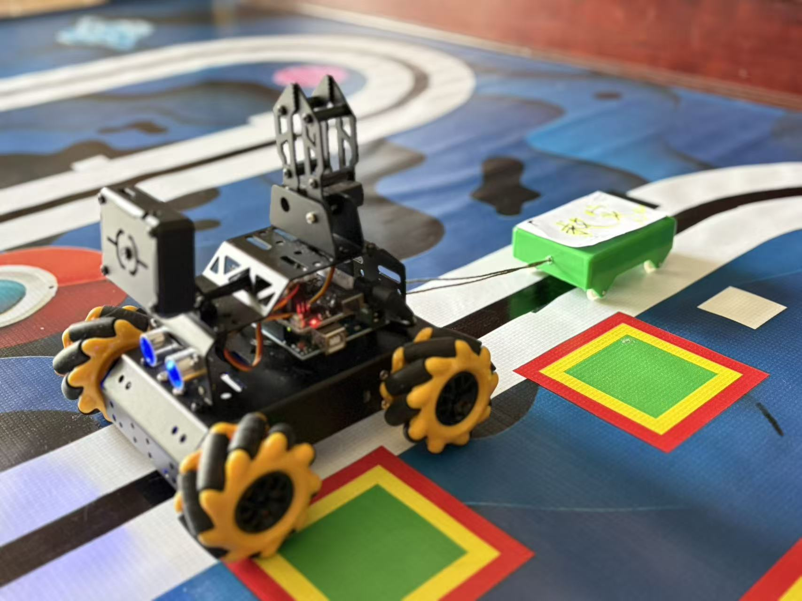

# GuardingStar-SmartRescuePlatform
The Guarding Star-Smart Rescue Platform is a disaster rescue simulation project based on a programmable smart car. It explores how smart vehicles can help in rescue missions when roads are blocked by earthquakes or floods.  

# 🌟 GuardingStar – Smart Rescue Platform  
# 守护星 · 智慧救援平台

This is an open-source student project from a primary school boy from Guangzhou, China.  
这是一个由中国广州的小学生完成的开源创意设计作品。  

---

## 🧩 Project Introduction / 项目简介
The **"GuardingStar Smart Rescue Platform** is a **disaster rescue simulation project** based on a programmable smart car.  
It explores how smart vehicles can help in rescue missions when roads are blocked by earthquakes or floods.  

## 守护星 · 智慧救援平台 是一个基于可编程智能小车的 **灾难救援模拟设计项目**，  
旨在探索在地震、洪水等灾害导致道路受阻时，智能装备如何辅助救援运输。  

---

## 🔧 Hardware & Features / 硬件与功能
- Arduino UNO + expansion board  
- Mecanum wheel chassis  
- Ultrasonic sensor for obstacle avoidance  
- Grayscale sensors for line following  
- RGB lights for status indication  
- ESP module for wireless video streaming  
- Servo (for future UAV docking)  

---

## 💻 Software Design / 软件设计
- Based on C/C++ with non-blocking logic  
- Remote control via mobile APP (with video streaming)  
- Auto line-following mode with obstacle avoidance  
- Mode switching button with mutual exclusion logic  
- Optimized power detection and serial protocol  

---

## 🎥 Demo / 演示

🎥 [Watch the demo video](https://www.xiaohongshu.com/explore/68bcf523000000001c00e1d4?app_platform=android&ignoreEngage=true&app_version=8.99.0&share_from_user_hidden=true&xsec_source=app_share&type=video&xsec_token=CBpiZ6BVeYbDZf9_UpzvJ_hBDayScLe_cvzJw5myBAQQA=&author_share=1&xhsshare=WeixinSession&shareRedId=ODo1N0dKSDw2NzUyOTgwNjZIOThKOzlL&apptime=1757213994&share_id=f84544a44bf648b78e057e864c5d72a4&share_channel=wechat)

---

## 📖 What We Learned / 项目收获
- Hardware integration (motors, sensors, ESP video)  
- Embedded programming with Arduino C++  
- Mode switching & coordination logic  
- Using AI to assist in **task planning, code optimization, and testing**  
- Combining creativity + AI + engineering in practice  

---

## 🚀 Future Work / 未来计划
- Add UAV docking & coordination (car + drone)  
- Optimize path planning with AI algorithms  
- Expand rescue simulation with more sensors  

---

## 👩‍💻 Contributors / 完成人
- Student: Yan  
- School: **  ...Central Primary School**  
- Mentor: Miss Gu 

---

## 📜 License
This project is open-source and free for educational and creative purposes.  
本项目开源，免费用于教育与创意制作。
